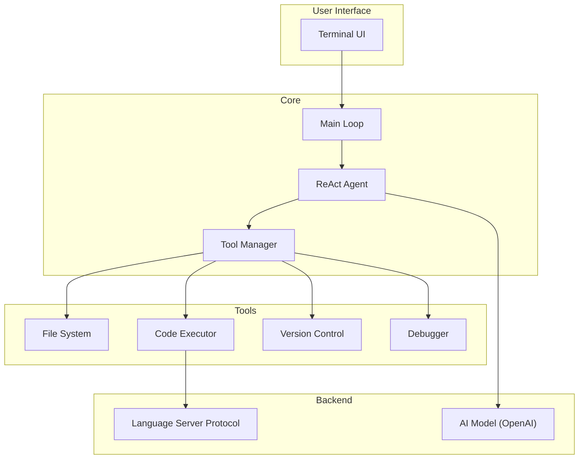

# Tide

Tide is an AI-powered terminal IDE that uses a ReAct agent to understand and execute user commands. It can interact with the file system, execute code, and perform other development tasks.

## Architecture

The project is structured as follows:

- `main.go`: The main entry point for the application. It initializes the agent and handles the user input loop.
- `agent/`: This directory contains the core logic for the ReAct agent.
    - `agent.go`: Defines the `ReActAgent`, its tools, and the main processing loop for handling commands.
- `tool/`: This directory contains the various tools that the agent can use to interact with the system.
    - `tool.go`: Defines the `Tool` interface that all tools must implement.
    - `code_writer.go`: A tool for writing code to files.
    - `file_editor.go`: A tool for modifying existing files.
    - `terminal.go`: A tool for executing shell commands.
- `go.mod`, `go.sum`: Go module files for managing dependencies.
- `conversation_history.json`: Stores the conversation history with the agent.
- `example/`: Contains example scripts.

### Future Architecture

## TODO

- [ ] **Terminal UI:** Implement a more interactive terminal UI using a library like `tview` or `bubbletea`.
- [ ] **LSP Integration:** Integrate with language servers for features like code completion, diagnostics, and go-to-definition.
- [ ] **Debugger Support:** Add a debugging tool that can interact with a debugger (e.g., Delve for Go).
- [ ] **Version Control:** Enhance the version control tool to support more complex Git operations.
- [ ] **Plugin System:** Develop a plugin system to allow for custom extensions and tools.
- [ ] **Web Search:** Implement a tool for searching the web to gather information.
- [ ] **Multi-LLM Support:** Allow configuration of different LLMs (e.g., Claude, Gemini).