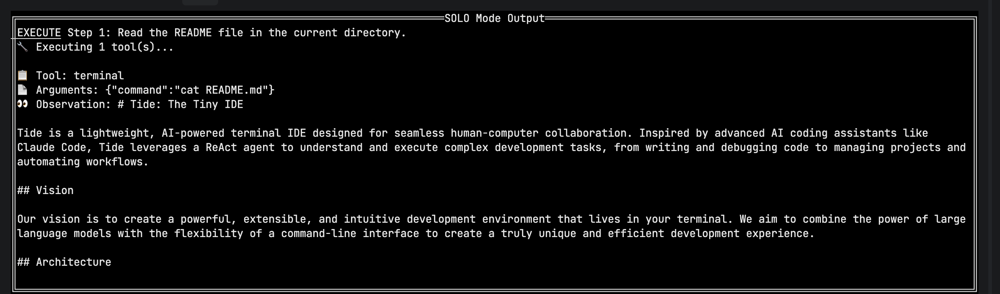
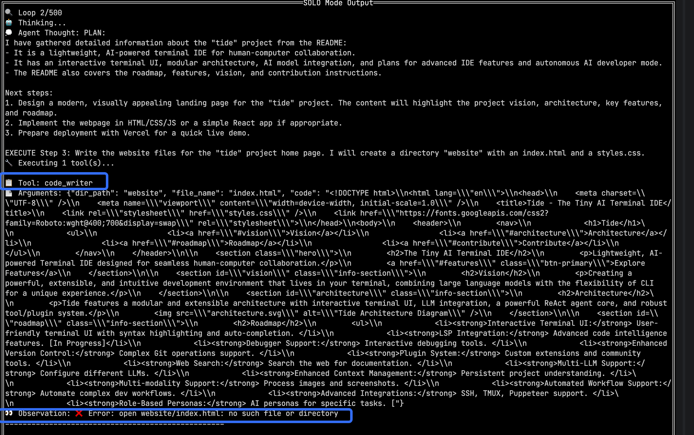

# Tide: The Tiny IDE

Tide is a lightweight, AI-powered terminal IDE designed for seamless human-computer collaboration. Inspired by advanced AI coding assistants like Claude Code, Tide leverages a ReAct agent to understand and execute complex development tasks, from writing and debugging code to managing projects and automating workflows.

## Vision

Our vision is to create a powerful, extensible, and intuitive development environment that lives in your terminal. We aim to combine the power of large language models with the flexibility of a command-line interface to create a truly unique and efficient development experience.

## Architecture

The future architecture of Tide is designed to be modular and extensible, allowing for the continuous integration of new tools and capabilities.


## Roadmap: Building a Claude-Code-Level Assistant

To achieve our goal of creating a top-tier AI coding assistant, we are focusing on the following key areas. Our roadmap is heavily inspired by the capabilities of Claude Code, and we aim to implement similar features to provide a competitive and powerful tool.

- [x] **Interactive Terminal UI:** Implement a more interactive and user-friendly terminal UI using a library like `tview` or `bubbletea`. This will provide a more IDE-like experience with features like syntax highlighting, auto-completion, and inline diagnostics.

- [ ] **LSP Integration:** Integrate with language servers via the Language Server Protocol (LSP). This will enable advanced code intelligence features, including:
    - Code completion
    - Go-to-definition
    - Hover information
    - Real-time diagnostics

- [ ] **Debugger Support:** Add a debugging tool that can interact with a debugger (e.g., Delve for Go). This will allow you to set breakpoints, inspect variables, and step through code without leaving the terminal.

- [ ] **Enhanced Version Control:** Enhance the version control tool to support more complex Git operations, such as interactive rebasing, cherry-picking, and managing pull requests.

- [ ] **Plugin System:** Develop a robust plugin system to allow for custom extensions and tools. This will enable the community to contribute to the Tide ecosystem and tailor it to their specific needs.

- [ ] **Web Search:** Implement a tool for searching the web to gather information, read documentation, and stay up-to-date with the latest technologies.

- [ ] **Multi-LLM Support:** Allow configuration of different LLMs (e.g., Claude, Gemini, GPT-4). This will give you the flexibility to choose the model that best suits your needs and preferences.

- [ ] **Enhanced Context Management:** Implement a more sophisticated context management system that maintains a persistent understanding of your project and conversation history. This will enable the agent to provide more relevant and accurate assistance.

- [ ] **Multi-modality Support:** Enable the agent to process and understand images and screenshots. This will be useful for tasks like:
    - Debugging UI issues from a screenshot.
    - Generating code from a wireframe.
    - Understanding diagrams and charts.

- [ ] **Automated Workflow Support:** Automate complex development workflows, such as:
    - Creating and reviewing pull requests.
    - Running and analyzing test suites.
    - Generating documentation.

- [ ] **Advanced Integrations:** Integrate with a wider range of developer tools, including:
    - SSH for remote development.
    - TMUX for session management.
    - Puppeteer for browser automation.

- [ ] **Role-Based Personas:** Implement different AI personas that can be activated for specific tasks. For example, you could have a "debugger" persona for finding and fixing bugs, or a "refactor" persona for improving code quality.

## Solo Mode: Autonomous AI Developer

Tide now features **Solo Mode**, a revolutionary capability that allows the AI agent to work autonomously on development tasks. In Solo Mode, the agent operates as a fully autonomous developer, capable of understanding complex requirements, planning implementation strategies, writing code, debugging, and even deploying projects without human intervention.

### How Solo Mode Works

Solo Mode leverages the ReAct (Reasoning + Acting) framework to create an intelligent agent that:

1. **Understands Requirements:** Analyzes user input to understand the full scope of the development task
2. **Creates Strategic Plans:** Develops comprehensive implementation strategies with clear milestones
3. **Writes Production-Ready Code:** Generates, tests, and refines code based on best practices
4. **Self-Debugs:** Identifies and fixes issues through iterative testing and analysis
5. **Deploys Solutions:** Can deploy completed projects to various platforms
6. **Reflects and Improves:** Continuously learns from outcomes to improve future performance

### Key Features

- **Full Autonomy:** Complete end-to-end development without human intervention
- **Dynamic Tool Discovery:** Automatically discovers and utilizes all available development tools
- **Context-Aware Planning:** Maintains deep understanding of project context throughout the process
- **Iterative Refinement:** Continuously improves solutions through cycles of implementation and testing
- **Multi-Language Support:** Capable of working with various programming languages and frameworks
- **Deployment Ready:** Can handle the entire lifecycle from development to deployment

### Usage

Activate Solo Mode by running:

```bash
go run . --solo
```

**⚠️ 重要提醒**：在部署到Vercel之前，请先确保已登录Vercel账号：
```bash
npm install -g vercel
vercel login
```

The agent will then prompt you for your development task and begin autonomous execution.

### Example Use Cases

- **New Project Creation:** "Create a RESTful API service with user authentication and database integration"
- **Feature Implementation:** "Add real-time chat functionality to my existing web application"
- **Bug Fixes:** "Fix the memory leak in my data processing pipeline"
- **Refactoring:** "Refactor my monolithic application into microservices architecture"
- **Deployment:** "Deploy my React application to AWS with CI/CD pipeline"

### Visual Demo

Here's a real-world example of Tide Solo Mode in action, creating a complete web application from scratch:

**Step 1: Initial Setup**


**Step 2: Planning & Architecture**


**Step 3: Code Generation**


**Step 4: Testing & Debugging**


**Step 5: Deployment Process**


**Step 6: Live Application**


**Bonus: Creating HTML Example**


**Mode Selection**


Try the live demo at [https://website-leabfvf4d-maxlius-projects-479d6676.vercel.app](https://website-leabfvf4d-maxlius-projects-479d6676.vercel.app)

## Practicing Context Engineering

A core philosophy of the Tide project is the practice of **Context Engineering**. This emerging discipline is crucial for maximizing the performance and accuracy of Large Language Models (LLMs). In Tide, we focus on three key pillars of Context Engineering:

1.  **Prompt Engineering:** We meticulously craft and refine the prompts sent to the LLM to ensure that our instructions are clear, concise, and unambiguous. This allows the model to better understand the user's intent and generate more accurate and relevant responses.

2.  **Context Management:** We are building a sophisticated system for managing the context of the conversation and the project. This includes maintaining a detailed history of the conversation, understanding the structure of the codebase, and tracking the state of the files being edited. This rich context allows the LLM to have a deeper understanding of the task at hand.

3.  **Tool Chaining:** We are creating a powerful and flexible toolchain that the LLM can use to interact with the development environment. By chaining together different tools, the agent can perform complex tasks that would be impossible with a single tool. This includes everything from running tests and debugging code to managing version control and automating workflows.

## Contributing

Tide is an open-source project, and we welcome contributions from the community. Whether you're a seasoned Go developer, an expert in LLMs, or just passionate about the future of software development, we'd love to have you on board. This is a great opportunity to get hands-on experience with cutting-edge AI technologies and help shape the future of AI-powered development.

Here are some ways you can contribute:

- **Implement new features:** Take a look at our roadmap and pick a feature that interests you.
- **Improve existing code:** Help us refactor and improve the quality of the codebase.
- **Fix bugs:** Find and fix bugs to make Tide more stable and reliable.
- **Write documentation:** Help us improve our documentation to make it easier for new users and contributors to get started.

If you're interested in contributing, please fork the repository and submit a pull request. We look forward to working with you!