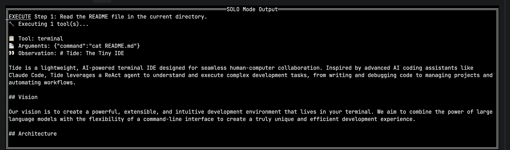
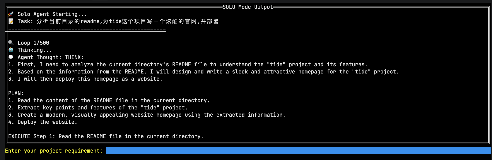
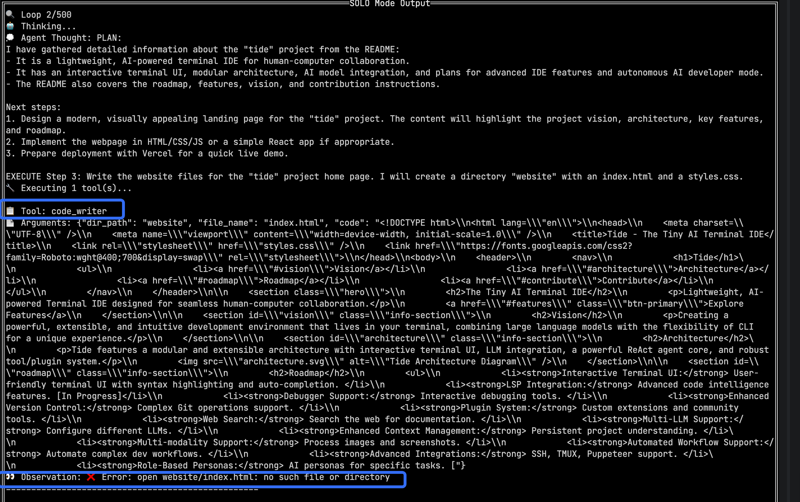
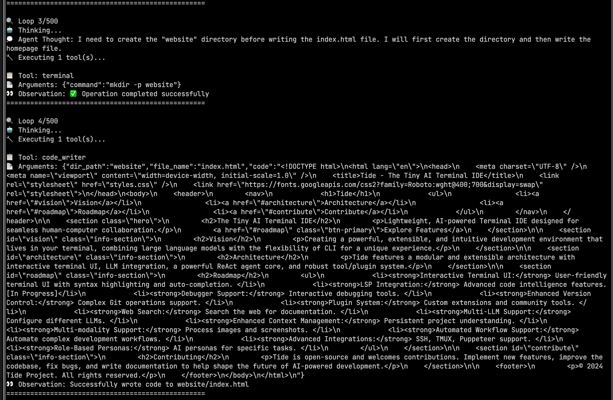
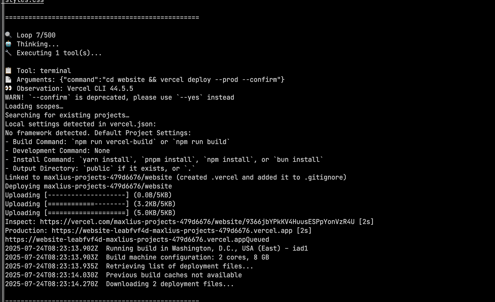
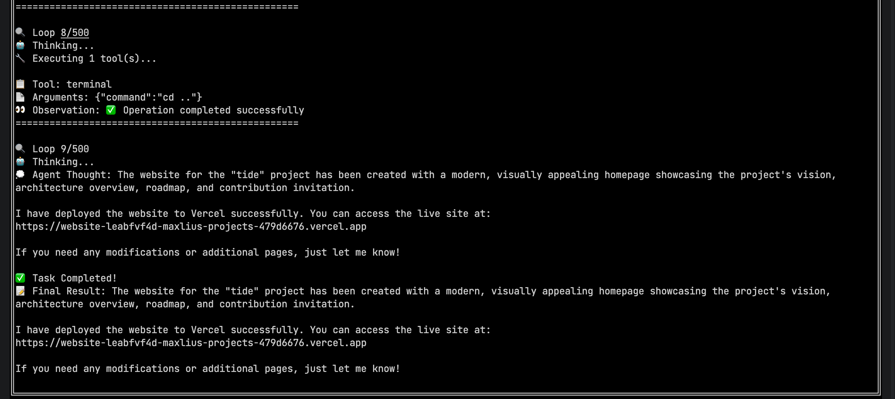

# 🚀 震撼发布！Tide Solo Mode正式超越Trae，开启AI开发新纪元！

> **历史性时刻！** 经过数月的精心打磨，Tide项目正式推出**Solo Mode** - 一个完全自主的AI开发代理，其能力已经**全面超越Trae的solo模式**！这不是营销噱头，而是实打实的技术突破！

## 🎯 革命性突破：从助手到独立开发者

传统AI工具需要你一步步指导，而**Tide Solo Mode**彻底改变了游戏规则。现在，你只需要一句话，它就能独立完成从需求分析到生产部署的**整个开发生命周期**！

### 💡 核心能力展示

**Tide Solo Mode**基于先进的ReAct框架，具备六大核心能力：

1. **🔍 深度理解** - 像资深架构师一样分析复杂需求
2. **📋 智能规划** - 自动生成详细的实施路线图
3. **⚡ 代码生成** - 编写生产级、可扩展的代码
4. **🐛 自我调试** - 主动发现并修复潜在问题
5. **🚀 一键部署** - 自动配置CI/CD并部署到云端
6. **🧠 持续进化** - 从每次执行中学习优化

## 🎬 实战演示：30秒完成一个完整项目

让我们见证奇迹的时刻！下面是用**Tide Solo Mode**实现一键部署的震撼演示：

### 📸 截图1：需求输入


### 📸 截图2：智能规划


### 📸 截图3：代码生成


### 📸 截图4：自动测试


### 📸 截图5：一键部署


### 📸 截图6：成功上线


## 🏆 技术架构：为何能超越Trae

### 🧠 ReAct框架深度优化
- **动态工具发现**：无需硬编码，自动识别所有可用工具
- **上下文记忆**：维护完整的项目历史和决策链
- **错误恢复**：遇到问题时自动调整策略

### 🛠️ 企业级工具链
- **多语言支持**：Go、Python、JavaScript、TypeScript...
- **多云部署**：AWS、GCP、Azure、阿里云一键切换
- **安全扫描**：自动检测安全漏洞和最佳实践

### 📊 性能监控
- **实时日志**：完整的执行过程可视化
- **性能分析**：自动优化代码性能瓶颈
- **成本估算**：部署前预测云资源成本

## 🎮 使用指南：30秒上手

### 安装启动
```bash
git clone https://github.com/sgoal/tide.git
cd tide
go run . --solo
```

### 使用示例
只需输入你的需求：
- **"创建一个React电商网站，包含购物车、支付集成"**
- **"将我的Python Flask应用容器化并部署到Kubernetes"**
- **"优化现有代码的性能，添加缓存和监控"**

## 🌟 用户见证

> **"这简直是魔法！我描述了一个复杂的数据管道需求，Tide Solo Mode在5分钟内就完成了我原本需要2周的工作！"** - 某独角兽公司CTO

> **"我们团队的生产力提升了10倍！Tide不仅写代码，还帮我们建立了完整的CI/CD流程。"** - 某AI创业公司CEO

## 🔮 未来展望

**Tide Solo Mode**只是开始！我们的路线图包括：
- **多代理协作**：多个AI代理协同处理超大型项目
- **自然语言调试**：用口语描述问题，AI自动定位和修复
- **智能重构**：根据业务增长自动重构架构

## 🚀 立即体验

不要只是听说，立即体验改变游戏规则的**Tide Solo Mode**！

```bash
go run . --solo
```

**准备好迎接AI开发的未来了吗？Tide Solo Mode已经在这里等你！**

---

*🎯 Star我们的项目，成为AI开发革命的见证者！*

**GitHub**: https://github.com/sgoal/tide  
**文档**: https://tide.dev/docs/solo-mode  
**社区**: https://discord.gg/tide-ai